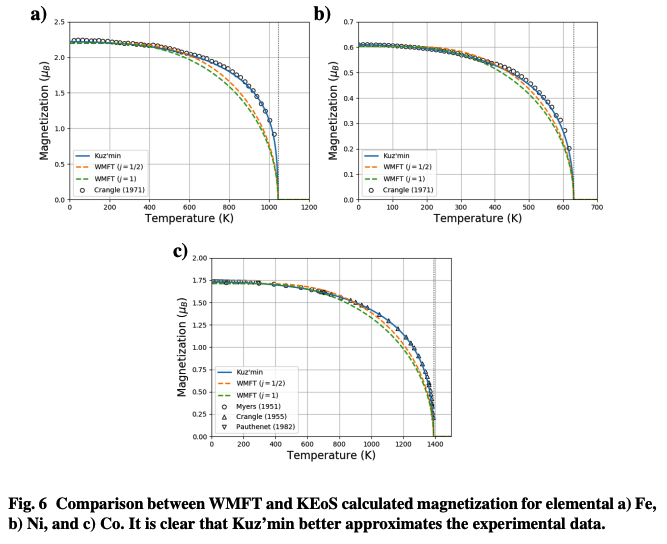

# WMFTmagnetization
Simple script to calculate magnetization using the Weiss mean field theory model and Kuz’min equation of state

This script was developed to compare the WMFT and Kuz'min models. It was published as part of an ARL tech note (ARL-TN-1027). To test, simply run

> `$ python magnetization.py`

which should save the `Ni-magnetization.png` (as shown in Fig. 6b).

 
